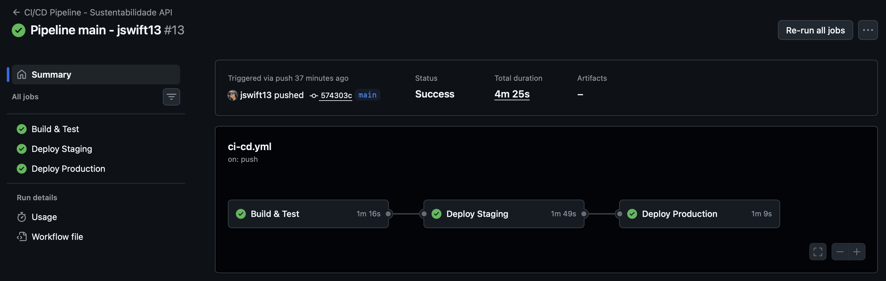
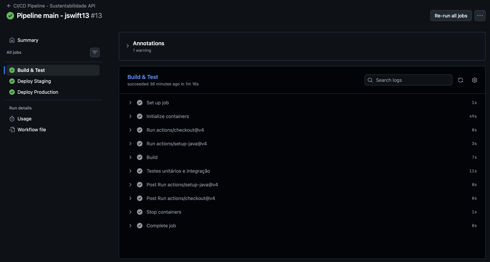
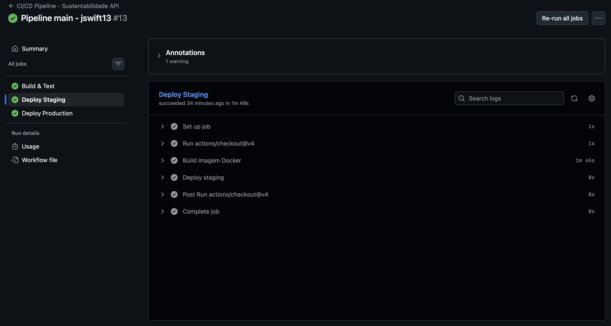
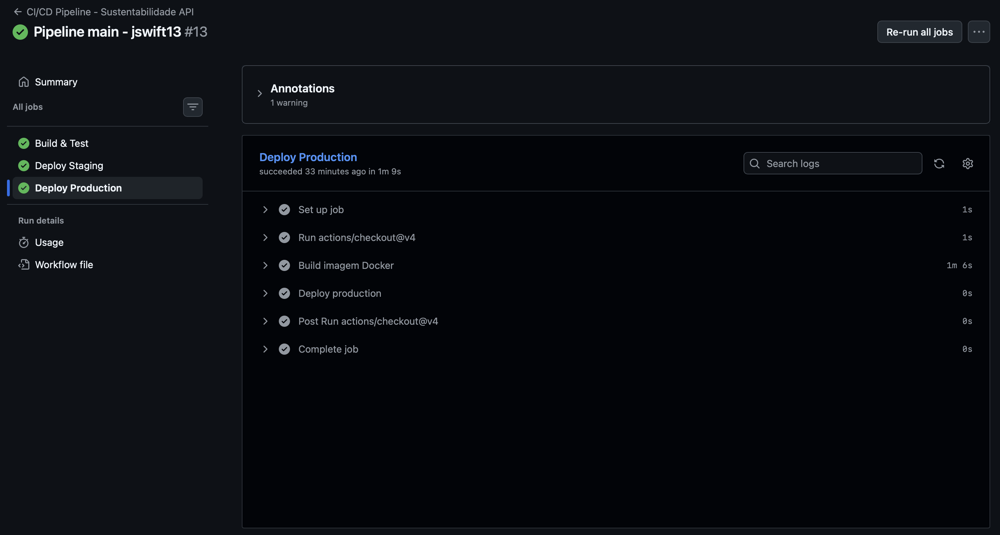

# Projeto - Cidades ESGInteligentes

Jenifer Lopes Ribas

Esta API é o motor de inteligência para monitoramento de sustentabilidade urbana, processando métricas de consumo energético, geração de energia solar e eficiência por setores.
O foco da fase 6 são práticas modernas de **DevOps**.

---

## Como executar localmente com Docker

A aplicação está totalmente containerizada, o que facilita o setup local sem necessidade de instalar o JDK ou Maven manualmente.

1.  **Build da Imagem:**
    ```bash
    docker build -t sustentabilidade-api .
    ```

2.  **Execução:**
    Certifique-se de que seu banco Oracle XE está acessível e execute:
    ```bash
    docker run -d -p 8080:8080 \
      --name api-sustentabilidade \
      -e SPRING_DATASOURCE_URL=jdbc:oracle:thin:@host.docker.internal:1521/XEPDB1 \
      -e SPRING_DATASOURCE_USERNAME=ESG \
      -e SPRING_DATASOURCE_PASSWORD=esg123 \
      sustentabilidade-api
    ```
    *Nota: No Windows/macOS, `host.docker.internal` aponta para o localhost da sua máquina.*

---

## Pipeline CI/CD

Utilizamos **GitHub Actions** para automação completa do ciclo de vida da aplicação. O pipeline está definido em `.github/workflows/ci-cd.yml` e é disparado a cada push nas branches `main` e `develop`.

### Etapas e Funcionamento:

1.  **Build & Test:**
    - Instala o JDK 17 (Temurin).
    - Sobe um container de serviço **Oracle XE (gvenzl/oracle-xe)** diretamente no runner do GitHub Actions para viabilizar testes de integração reais.
    - Executa `./mvnw test` validando as regras de negócio e persistência.
2.  **Deploy Staging:**
    - Executado automaticamente após o sucesso dos testes.
    - Realiza o build da imagem Docker.
    - Simula o deploy em ambiente de homologação (porta 8080).
3.  **Deploy Production:**
    - Restrito à branch `main`.
    - Realiza o deploy em ambiente de produção (porta 8081).
    - Utiliza variáveis de ambiente específicas para isolamento de carga.

---

## Containerização

A estratégia de containerização utiliza **Multi-stage Build**, garantindo uma imagem final leve e segura.

### Conteúdo do Dockerfile:
```dockerfile
# STAGE 1: Build (Ambiente de compilação)
FROM eclipse-temurin:17-jdk AS build
WORKDIR /app
COPY .mvn/ .mvn
COPY mvnw pom.xml ./
RUN ./mvnw -q -DskipTests dependency:go-offline
COPY src ./src
RUN ./mvnw -q -DskipTests package

# STAGE 2: Runtime (Ambiente de execução otimizado)
FROM eclipse-temurin:17-jre
WORKDIR /app
COPY --from=build /app/target/*.jar app.jar
EXPOSE 8080
ENTRYPOINT ["sh","-c","java $JAVA_OPTS -jar /app/app.jar"]
```

**Estratégias adotadas:**
- **Isolamento de build:** A imagem final contém apenas o JRE (Java Runtime Environment) e o `.jar` final, sem o código-fonte ou ferramentas de build (Maven), reduzindo a superfície de ataque.
- **Cache de dependências:** O uso do `dependency:go-offline` acelera builds subsequentes ao cachear camadas do Maven.

---

## Prints do funcionamento

Aqui estão as evidências do ecossistema DevOps em funcionamento:

**Visão Geral:**



**Etapas:**

Build:



Deploy Staging:



Deploy Production:


---

## Tecnologias utilizadas

- **Linguagem/Framework:** Java 17, Spring Boot 3.x
- **Banco de Dados:** Oracle XE 21c
- **CI/CD:** GitHub Actions
- **Containerização:** Docker (Multi-stage)
- **Segurança:** Spring Security (Basic Auth)

---

## Checklist de Entrega

| Item | Status |
| :--- | :---: |
| Projeto compactado em .ZIP com estrutura organizada | [x] |
| Dockerfile funcional | [x] |
| docker-compose.yml ou arquivos Kubernetes | [x] |
| Pipeline com etapas de build, teste e deploy | [x] |
| README.md com instruções e prints | [x] |
| Documentação técnica com evidências (PDF ou PPT) | [x] |
| Deploy realizado nos ambientes staging e produção | [x] |